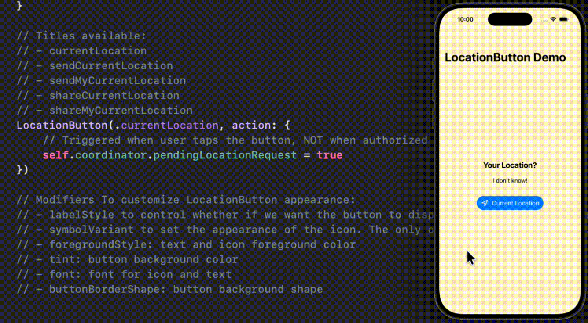

# SwiftUI_LocationButtonDemo

A demo of using LocationButton to request for location permission.

For more details, please check out my blog [Little SwiftUI Tip: An Easier(Hopefully) Way to Get  Location Permission]()

## Sample Usage
```
LocationButton(.currentLocation, action: {
    // Triggered when user taps the button, NOT when authorized
    self.coordinator.pendingLocationRequest = true
})
```




## Customizations
### Title
 Titles available:
 - currentLocation
 - sendCurrentLocation
 - sendMyCurrentLocation
 - shareCurrentLocation
 - shareMyCurrentLocation

### Other styles
 Modifiers To customize LocationButton appearance:
 - labelStyle to control whether if we want the button to display an icon, a label, or both
 - symbolVariant to set the appearance of the icon. The only one has effect is `fill`.
 - foregroundStyle: text and icon foreground color
 - tint: button background color
 - font: font for icon and text
 - buttonBorderShape: button background shape


